# Orchestrate-AI Architecture Diagram

Below is a Mermaid diagram representation of the Orchestrate-AI architecture. This diagram shows the relationships between the core components of the system.

```mermaid
graph TD
    %% Core Components
    TaskOrchestrator(["Task Orchestrator<br/>(Component)"])
    IntentPreserver(["Intent Preserver<br/>(Component)"])
    SelfImprovementEngine(["Self-Improvement Engine<br/>(Component)"])
    N8NIntegration(["N8N Integration<br/>(Component)"])
    AutomatedTesting(["Automated Testing<br/>(Component)"])
    AnalyticsEngine(["Analytics Engine<br/>(Component)"])
    SecurityMonitor(["Security Monitor<br/>(Component)"])
    UserFeedbackCollector(["User Feedback Collector<br/>(Component)"])
    
    %% Processes
    ValueMetricsProcess["Value Metrics Process<br/>(Process)"]
    DataIngestionPipeline["Data Ingestion Pipeline<br/>(Pipeline)"]
    
    %% Services & Integrations
    APIGateway{{"API Gateway<br/>(Service)"}}
    DevOpsIntegration{{"DevOps Integration<br/>(Integration)"}}
    
    %% Data Stores
    KnowledgeRepository[("Knowledge Repository<br/>(DataStore)")]
    
    %% Users
    EnterpriseUser>"Enterprise User<br/>(UserType)"]
    IndividualUser>"Individual User<br/>(UserType)"]
    
    %% Metrics
    TaskCompletionMetric["Task Completion<br/>(Metric)"]
    UserSatisfactionMetric["User Satisfaction<br/>(Metric)"]
    
    %% Core Relationships
    TaskOrchestrator -->|sends tasks to| IntentPreserver
    IntentPreserver -->|validates intents for| N8NIntegration
    SelfImprovementEngine -->|optimizes| TaskOrchestrator
    SelfImprovementEngine -->|suggests improvements for| N8NIntegration
    AutomatedTesting -->|provides feedback to| SelfImprovementEngine
    N8NIntegration -->|triggers| AutomatedTesting
    TaskOrchestrator -->|reports metrics to| SelfImprovementEngine
    TaskOrchestrator -->|implements| ValueMetricsProcess
    ValueMetricsProcess -->|feeds data to| SelfImprovementEngine
    
    %% Advanced Relationships
    APIGateway -->|forwards data to| DataIngestionPipeline
    DataIngestionPipeline -->|submits tasks to| TaskOrchestrator
    SelfImprovementEngine -->|consumes insights from| AnalyticsEngine
    AnalyticsEngine -->|tracks| TaskCompletionMetric
    AnalyticsEngine -->|tracks| UserSatisfactionMetric
    EnterpriseUser -->|provides feedback to| UserFeedbackCollector
    IndividualUser -->|provides feedback to| UserFeedbackCollector
    UserFeedbackCollector -->|sends data to| AnalyticsEngine
    DevOpsIntegration -->|executes| AutomatedTesting
    TaskOrchestrator -->|influences| TaskCompletionMetric
    UserFeedbackCollector -->|influences| UserSatisfactionMetric
    SelfImprovementEngine -->|stores learnings in| KnowledgeRepository
    KnowledgeRepository -->|provides context to| TaskOrchestrator
    SecurityMonitor -->|protects| APIGateway
    SecurityMonitor -->|validates| DataIngestionPipeline
    N8NIntegration -->|automates workflows for| DataIngestionPipeline
    DevOpsIntegration -->|configures| SecurityMonitor
    IntentPreserver -->|logs intent history to| KnowledgeRepository
    AnalyticsEngine -->|provides data for| ValueMetricsProcess
    EnterpriseUser -->|interacts with| APIGateway
    IndividualUser -->|interacts with| APIGateway
    
    %% Enhanced Styling
    classDef component fill:#6366F1,stroke:#312E81,stroke-width:2px,color:white,font-weight:bold
    classDef process fill:#10B981,stroke:#065F46,stroke-width:2px,color:white,font-weight:bold
    classDef service fill:#F59E0B,stroke:#92400E,stroke-width:2px,color:white,font-weight:bold
    classDef integration fill:#8B5CF6,stroke:#5B21B6,stroke-width:2px,color:white,font-weight:bold
    classDef datastore fill:#EC4899,stroke:#831843,stroke-width:2px,color:white,font-weight:bold
    classDef usertype fill:#3B82F6,stroke:#1E40AF,stroke-width:2px,color:white,font-weight:bold
    classDef metric fill:#EF4444,stroke:#991B1B,stroke-width:2px,color:white,font-weight:bold
    
    class TaskOrchestrator,IntentPreserver,SelfImprovementEngine,N8NIntegration,AutomatedTesting,AnalyticsEngine,SecurityMonitor,UserFeedbackCollector component
    class ValueMetricsProcess,DataIngestionPipeline process
    class APIGateway service
    class DevOpsIntegration integration
    class KnowledgeRepository datastore
    class EnterpriseUser,IndividualUser usertype
    class TaskCompletionMetric,UserSatisfactionMetric metric
```

## How to View the Diagram

To render this diagram:

1. View this file on GitHub - GitHub natively renders Mermaid diagrams
2. Use a Markdown editor that supports Mermaid (like VS Code with the Markdown Preview Mermaid Support extension)
3. Copy the diagram code to an online Mermaid editor like https://mermaid.live

## Legend

- **Components** (Indigo): Core system modules that perform specific functions
- **Processes** (Green): Workflows and procedures that coordinate activities
- **Services** (Amber): External-facing interfaces that provide functionality
- **Integrations** (Purple): Connections to external systems and tools
- **DataStores** (Pink): Repositories for persistent information
- **UserTypes** (Blue): Categories of users who interact with the system
- **Metrics** (Red): Measurable indicators of system performance

## Architecture Highlights

1. **Feedback Loops**: Multiple feedback mechanisms ensure continuous improvement
2. **Data Flow Architecture**: Clear pathways for information
3. **Security Integration**: Security as a cross-cutting concern
4. **Knowledge Management**: Central repository for learnings
5. **Value-Driven Prioritization**: Tasks selected based on highest value
